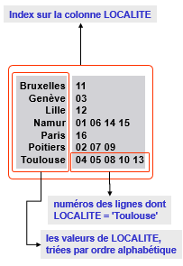

*Synthèse écrite par M. Petit sur base du cours donné par S. Faulkner s'appuyant sur un support de cours réalisé par J-L Hainaut.
Des phrases sont reprises en partie ou tels quelles de ce document.*

## BDD

### Concepts des BD (Concepts)

#### Sommaire

* [Définitions](#def)
  * identifiant
  * identifiant minimal
  * clé étrangère
  * table normalisée
* [Contraintes d'intégrités](#intégrité)
  * Colonnes obligatoires
  * unicité
  * référentielle
* [Redondances](#redondance)
  * Risques
  * Détection
  * Solution
* [Structures physiques](#structPhy)
  * index
  * espaces de stockages

#### Définitions

* Un **identifiant** est un groupe de colonnes d'une table T tel qu'il ne puisse, à tout moment, exister plus d'une ligne dans T qui possède des valeurs déterminées pour ces colonnes.  La valeur de l'identifiant permet de désigner une ligne de T.
= clé primaire
> Une table peut posséder plusieurs identifiants. On choisit l'un d'eux, qu'on déclare primaire (constitué de colonnes obligatoires). Les autres sont dès lors secondaires.
L'identifiant primaire est constitué de colonnes obligatoires.

* un **identifiant est minimal** si chacune de ses colonnes est nécessaire pour garantir la contrainte d'unicité (voir plus bas). = clé candidate

* Une **clé étrangère** est un groupe de colonnes d'une table S tel qu'il existe, à tout moment, dans une table T, une ligne dont l'identifiant a pour valeur(s) celle(s) de ce groupe.  La valeur de la clé étrangère sert à référencer une ligne de la table T. = clé secondaire

> référence de préférence l'identifiant primaire de la table cible et est du même type et du même nombre de colonnes.
Si une des colonnes de la clé étrangère est facultative, il est préférable de les rendres toutes facultatives.
Pas de `null` dans une clé étrangère (sauf exception dans les structures cycliques directes).
La clé étrangère peut être/faire partie d'un identifiant.

* Une **table normalisée** est une table sans dépendance fonctionelle anormale (la réciproque est vrai).

#### Contraintes d'intégrités

"Une modification ne sera effectuée que si son résultat ne viole aucune contrainte d'intégrité."

* **colonnes obligatoires**
* **contraintes d'unicité**, définie par un identifiant.
* **contraintes référentielle**, définie par une clé étrangère.

En cas de mise en danger de la contrainte référentielle (suppression d'une ligne référencée par une autre table), 
4 comportements sont possibles : 
  * `no action` : opérations refusées
  * `cascade` : supprime la ligne et les lignes référentes
  * `set null` : si possible (pas de contraintes de colonnes obligatoires), la valeur de la référence est mise à null, sinon opération refusée.
  * `set default` : la valeur référencante est mise à la valeur par défaut, si il y en a une, sinon opération refusée.
* **dépendance fonctionelle** (slide 26), une colonne ou unn groupe de colonnes peut être déterminée par une ou plusieurs colonnes (ex: ISBN détermine AUTEUR et TITRE car deux livres qui ont le même numéro d'ISBN devront avoir le même AUTEUR ET TITRE, donc ISBN est déterminant de AUTEUR et TITRE). Il y a redondance s'il existe un déterminant qui n'est pas identifiant de la table = dépendance fonctionelle anormale

#### Redondances
  
> Note: La normalisation c'est important mais à relativiser ! "L'ancienne génération" est obnubilée par ça, seulement avec un autre point de vue on peut voir que la normalisation PEUT entrainer des pertes de performances. Seulement la gestion de cette dénormalisation doit être faite avec soin et au travers de programmation procédurale interne à la DB. **Quoi qu'il advienne l'important est de débusquer la dénormalisation et par après décider ce qu'on en fait.**
  
**Redondance** 
Tout fait du domaine d'application est enregistré une et une seule fois. 

**Risque:**
* gaspillage d'espace
* perte de consistance de données (des valeurs différentes) lors de changements ou lors d'insertion d'une info déjà existante.
* perte d'informations en chaines "si on supprime l'unique exemplaire d'un livre, on perd les informations sur son auteur et son titre".

**Détection:**

* Trouver les déterminants qui ne sont pas des identifiants

**Solution**

1. En conservant dans la première table le déterminant identifiant et ses déterminés.
2. En créant une dexuième table avec le déterminant non identifiant et les résidus et en faire l'identifiant.
3. En recommençant à 1 avec la deuxième table s'il existe encore de la redondance.

#### Structures physiques

L'intérêt et ce qui a fait le succès de SQL et sa facilité d'utilisation et sa démarquation entre gestion physique et logique. Pour donner un exemple, dans une bibliothèque il existe une organisation logique des livres (par auteur, ISBN, style, ...) et une organisation physique ! Comment les livres sont arrangés phyisquement dans la bibliothèques, dans quelle pièce ? à quel moment du trajet du spectateur ? à quelle hauteur (hauteur des yeux, aux sols, ...). Les structures physiques en SQL servent à ce dernier rôle àd es fins d'optimisation surtout, notamment pour des requêtes fréquemment éxécutées, des données dont on se rend compte qu'on a souvent besoin, tout cela en toute transparence du spectateur qui ne voit que l'organisation logique.

##### Index
* Le SGBD crée des tables de métadonnées (invisible à l'utilisateur).
* À comparer à un index de livre, un index sur une colonne va garder en mémoire chaque valeur distincte présente dans la colonne et l'associer avec la(les) ligne(s) dans laquelle elle est présente. Or l'accès à une ligne via un identifiant ne prend que quelques millisecondes ! Par défaut il existe un index sur les clés primaires et étrangères ! 

* On définirat de préférence un index sur : 
  * un identifiant, rapidité devérification et d'accès avant insertion de lignes.
  * une clé étrangère, rapidité de vérification et d'accès avant suppression de lignes
  * les colonnes fréquemment utilisées.

##### Espaces de stockage

* Fichier occupant tout ou partie d'un disque caractérisé notamment par son adresse, son volume initial, la manière dont il grandit ou se réduit selon les besoins, les tables dont il accueille les lignes, la technique de rangement des lignes.
* Arrangement physique des données, fichiers de data mais aussi de logs ! On peut gérer ces fichiers de data différemment en fonction de ce qu'ils contiennent et donc appliquer des politiques administratives différentes !
