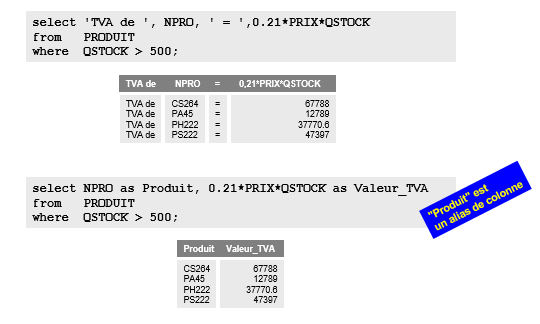
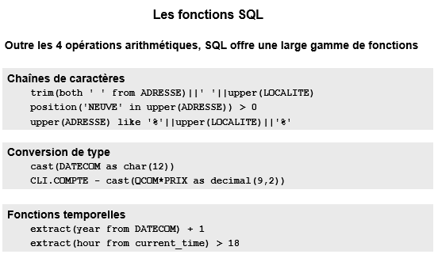
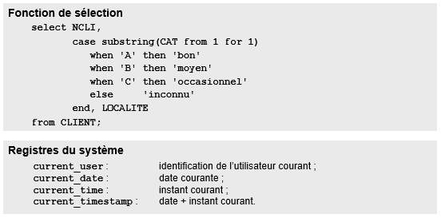
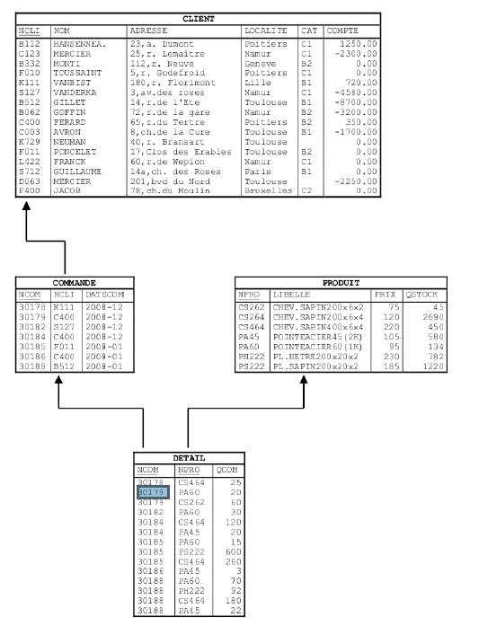

*Synthèse écrite par M. Petit sur base du cours donné par S. Faulkner s'appuyant sur un support de cours réalisé par J-L Hainaut.
Des phrases sont reprises en partie ou tels quelles de ce document.*

## BDD

### DML 1

> attention une partie de DML est vue du point de vue de SQL2, qui permet une approche plus conceptuelle d'SQL que la norme SQL3

DML concerne 4 requêtes : `SELECT`, `INSERT`, `DELETE` et `ÙPDATE`

#### Sommaire

* [SELECT](#select)
  * extraction simple
  * [WHERE](#where)
  * [Données dérivées](#dd)
  * [Fonctions aggrégatives](#aggreg)
  * [Sous-requêtes](#subq)
  * [IN/NOT IN](#in)
  * [SR corrélées](#SRC)
  * [Exist/All/Any](#Exist)


<a id="select"></a>  
#### SELECT
* renvoie une table (même une table de 1 lignes et 1 colonne) 
* On peut faire un SELECT sur le résultat d'un SELECT (attention limite en SQL2).

```
/*Extraction simple*/

select NCLI, NOM 
     from   CLIENT;
```
* `distinct` permet de sélectionner les valeurs d'une colonnes sans les doublons ! Toutes les *différentes* valeurs d'une colonnes.

<a id="where"></a>
##### WHERE
```
/*Extraction simple/*

select NCLI, NOM 
     from   CLIENT 
     where  LOCALITE = 'Toulouse';
     ...
     where CAT in ('C1', 'C2', 'C3');
     ...
     where COMPTE between 1000 and 4000;
     ...
     where CAT like 'C_';
     ...
     where LIBELLE like '%SAPIN%';
     ...
     where  LOCALITE = 'Toulouse' and COMPTE < 0; 
     ...
     where  COMPTE > 0
     and    (CAT = 'C1' or LOCALITE = 'Paris')


```
* `where col IS null ` et pas `WHERE CAT = null` et donc la réciproque `IS NOT NULL`
* `IN` permet de spécifier un tableau de valeurs à laquelle la colonne pour appartenir ou pas.
* `BETWEEN` permet de spécifier un range de valeur à respecter.
* `LIKE` permet de spécifier un "masque" ou `_` vaut un caractère quelconque et obligatoire ( et donc pas zéro ! ) et `%` un/plusieurs caractères quelconque. CASE SENSITIVE ! 
`_%` permet de forcer un caractère minimum.
* on peut utiliser les opérateurs logiques `and` et `or`

<a id="dd"></a>
##### Données extraires et données dérivées - expressions de calcul



* possiblités de mettre des colonnes "remplies" d'un texte défini dans le SELECT
* possiblités de SELECT une colonne composée d'un calcul entre plusieurs colonnes.
* possibilité d'aliaser le nom d'une colonne, pour qu'elle soit plus riche sémantiquement aux yeux de l'utilisateur par exemple. **Un alias dans un SELECT ne peut être utilisé que dans un ORDER BY et nulle part ailleurs, ceci du à l'ordre d'éxécution interne des requêtes (SELECT en avant dernier)**.




<a id="aggreg"></a>
##### Fonction Aggrégatives

* SQL contient 5 fonctions aggrégatives : `avg`, `sum`, `count`, `min` et `max`.

* Une fonction aggrégative ne renvoie qu'une seule ligne !

* Si une colonne dans le `SELECT` n'est pas concernée par une fonction aggrégative, elle DOIT se trouver dans le `GROUP BY`. Ce n'est que dans ce cas là que `GROUP BY` est obligatoire !

* Attention aux doublons quant aux requêtes aggrégatives ne portant pas sur une clé primaire.


```
select 'Namur',avg(COMPTE) as Moyenne,
            max(COMPTE)-min(COMPTE) as Ecart_max,
            count(*) as Nombre
     from   CLIENT 
     where  LOCALITE = 'Namur'; 
/* Renvoie la moyenne des comptes des clients habitant namur, l'ecart max entre tous leurs comptes et le nombre de client habitant namur*.

...
select count(NCLI)
    from COMMANDE;
    
/*Renvoie le nombre de commandes passées et pas les clients qui ont passés des commandes, des clients ont passés plusieurs fois des commandes*/

select count(distinct NCLI)
     from   COMMANDE; 
/* Renvoie le nombre de clients différents qui ont passés commandes !*/

```

<a id="subq"></a>
##### Les Sous-Requêtes / Requêtes Imbriquées

```
select NCOM, DATECOM
     from   COMMANDE
     where  NCLI in (select NCLI
                     from   CLIENT
                     where  LOCALITE = 'Namur');
                     
/* Renvoie le numéro de la commande et la date de la commande effectuée par un client habitant Namur */

select *
     from   PRODUIT
     where  NPRO in 
            (select NPRO
             from   DETAIL
             where  NCOM in
                    (select NCOM
                     from   COMMANDE
                     where  NCLI in
                            (select NCLI
                             from   CLIENT 
                             where  LOCALITE='Namur')));
                             
/* Retourne toutes les informations concernant les produits des clients habitant Namur */ 
```
<a id="in"></a>
* `in (sous-requêtes)` permet d'exprimer une **condition d'association**. De plus `not in (sous-requêtes)` est le seul moyen correcte d'exprimer une condition de non association.

```
Quelles sont les commandes qui ne spécifient pas le produit PA60 = qui ne sont pas associées à un détail spécifiant PA60 ???

select NCOM, DATECOM, NCLI 
     from   COMMANDE
     where  NCOM in (select NCOM
                     from   DETAIL
                     where  NPRO <> 'PA60');

/* FAUX car va retourner des commandes qui ont passés commandes de PA60 ET d'autres choses ... Donc la sous-requêtes n'élimine que les commandes qui n'ont demandé QUE du PA60 et vont donc se retrrouver dans le résultat final*/

SELECT NCOM, DATECOM, NCLI
    from COMMANDE
    WHERE NCOM not in (SELECT NCOM
                            from DETAIL
                                WHERE NPRO = 'PA60');

/* Ici, la sous-requêtes retourne bien les commandes n'ayant concerné que du PA60 mais AUSSI les commandes qui ont commandé du PA60 en plus d'autre chose. Du coup dans commande on prend toutes les infos des commandes qui ne se retrouvent pas dans le résultat de la subquery*/
```
<a id="SRC"></a>
* Les *sous-requêtes corrélées* font référence aux colonnes de la requête parents. En aliasant la table de la requête principale, on peut faire référence à celle-ci dans la sous-requête et ainsi la parcourir à deux vitesses différentes. Cet alias est nécessaire pour bien différencier les deux tables.

```
/* On cherche à avoir la liste des clients dont le compte dépasse la moyenne des comptes des autres clients habitant la même localité */

select NCLI, NOM, LOCALITE, COMPTE -------------------(6)
     from   CLIENT as C ------------------------------(1)
     where  COMPTE > ---------------------------------(5)
                    (select avg(COMPTE) --------------(4)   
                      from   CLIENT ------------------(2)
                      where  LOCALITE = C.LOCALITE); -(3)
                      
/* On bloque la première ligne de C, on mémorisée sa LOCALITE,  on va dans CLIENT, et pour ont fait la moyenne des COMPTE des CLIENT habitant la LOCALITE mémorisée, entre parenthèse, l'ordre des actions faites en SQL (à prendre avec précaution, je ne m'avance pas à 100% sur cet ordre, je peux m'être trompé sur cette partie !!!)*/

```
<a id="Exist"></a>
* **Les quantificateurs ensemblistes** sont : `exists` et `no exists`, `all` et `any`. 
`Exists(E)` est vrai si E, une sous-requête, renvoie un ensemble non-vide.  
The `ANY` operator returns true if any of the subquery values meet the condition.
The ``ALL`` operator returns true if all of the subquery values meet the condition. thx [w3c](https://www.w3schools.com/sql/sql_any_all.asp)


### Annexe

**Tables utilisée dans les exemples



