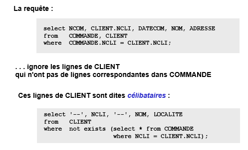
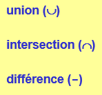
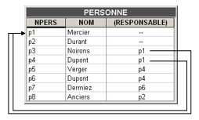
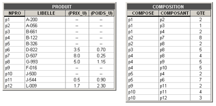
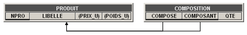

*Synthèse écrite par M. Petit sur base du cours donné par S. Faulkner s'appuyant sur un support de cours réalisé par J-L Hainaut.
Des phrases sont reprises en partie ou tels quelles de ce document.*

## BDD

### DML 2

> attention une partie de DML est vue du point de vue de SQL2, qui permet une approche plus conceptuelle d'SQL que la norme SQL3.

DML concerne 4 requêtes : `SELECT`, `INSERT`, `DELETE` et `ÙPDATE`

#### Sommaire

* [Les jointures](#jointures)
    * généricité
    * [lignes célibataires](#célibat)
    * [SR >< Jointure](#SRJoint)
* [Les opérateurs Ensemblistes](#opEnsembl)
* [Les Structures Cycliques](#structCycl)
  * [directe](#directe)
  * [indirecte](#indirecte)
* [Les données groupées](#groupData)
* [Ordre d'interprétation](#ordre)
  


<a id="jointures"></a>
#### Les Jointures

* La jointure permet de produire une table constituée de données extraites de plusieurs tables, contrairement aux requêtes imbriquées. 

```
select NCOM, CLIENT.NCLI, DATECOM, NOM, LOCALITE
     from   COMMANDE, CLIENT
     where  COMMANDE.NCLI = CLIENT.NCLI; ---------- Condition de jointure
     
select CLIENT.NCLI, NOM, DATECOM, NPRO
     from   CLIENT, COMMANDE, DETAIL
     where  CLIENT.NCLI = COMMANDE.NCLI
     and    COMMANDE.NCOM = DETAIL.NCOM;
```
* Quand onf ait référence à une colonne qui à le même nom dans deux tables, importance d'un préfixe ! Ici `COMMANDE.ncli`. Ne pas hésiter à "aliaser" pour raccourcir les préfixes. 
* Plus d'info sur la jointure et les différents [JOIN](http://sqlpro.developpez.com/cours/sqlaz/jointures/) en sql2.

<a id="célibat"></a>
* **lignes célibataires**, il faut veiller à faire attention en joignant deux tables, il est possible de ne pas voir qu'il y a des lignes célibataires. C'est à dire des lignes de la colonne de jointure qui apparaissent dans une mais n'ont pas d'équivalent dans l'autre. 


<a id="SRJoint"></a>
* on peut utiliser une **SR ou une jointure** indifféremment dans une condition d'association seulement ! Quand on a une condition de non-association, seul la SR permet de l'exprimer correctement (voir [ici](https://github.com/EPHEC-TI/2TI/blob/master/202-DevAvanc%C3%A9Web/3-BaseDeDonn%C3%A9es/synth%C3%A8se_DML_1.md#in)).

<a id="opEnsembl"></a>
#### Les Opérateurs Ensemblistes
<!---->

* Les trois opérateurs ensemblistes sont `union`(UNION &#x222a;), `intersect` (INTERSECTION 	&#x2229;) et `except` (DIFFERENCE -).

* On ne peut les appliquer que  sur des structures semblables (même nombre, nom et type de colonnes !).  

```
select NOM 
from   T1
union 
select NOM 
from   T2
...
select NOM 
from   T1
intersect 
select NOM 
from   T2
...
select NOM 
from   T1
except 
select NOM 
from   T2

```

* `T1 union T2`, ce qui est dans T1 "+" ce qui est dans T2.
* `T1 intersect T2`, ce qui est dans T1 ET dans T2.
* `T1 except T2`, ce qui dans T1 ET PAS dans T2.

* Par défaut, ces opérateurs élimineront les doublons ( des solutions peuvent ainis ne pas apparaitre lors d'un except par exemple). Si on veut surpasser ce comportement, il faut utiliser le mot clé `all` après l'opréateur.

* Ces opérateurs permettent de résoudre le problème des [lignes célibataires](#célibat). 
```
select NCOM, CLIENT.NCLI, DATECOM, NOM, LOCALITE
     from   COMMANDE, CLIENT
     where  COMMANDE.NCLI = CLIENT.NCLI
     union
     select null as NCOM, NCLI, null as DATECOM, NOM, LOCALITE
     from   CLIENT
     where  not exists (select * from COMMANDE 
                        where NCLI = CLIENT.NCLI);
```
<a id="structCycl"></a>
#### Les Structures Cycliques

Une table qui se référence elle-même. 
<a id="directe"></a>
##### Structure cyclique directe


<a id="indirecte"></a>

* Utilisation de requêtes corrélées ! 

```
select S.NPERS, R.NPERS, R.NOM
     from   PERSONNE S, PERSONNE R
     where  S.RESPONSABLE = R.NPERS;
...
select S.NPERS, R.NPERS, R.NOM
     from   PERSONNE S, PERSONNE R
     where  S.RESPONSABLE = R.NPERS
     and    S.NOM = 'Dupont'
     union --------------------------- au cas ou un emplyé s'appelle Dupont et a pas de responsable.
     select NPERS, '--', '--'
     from   PERSONNE
     where  RESPONSABLE is null and NOM = 'Dupont';

```

##### Structure cyclique indirecte



```
/* Donner le nom, le libellé et la quantité des composants du produit 'p4' et le libellé de p4 */
select H.NPRO,H.LIBELLE,C.QTE,B.NPRO,B.LIBELLE-----(5)
     from   PRODUIT H, COMPOSITION C, PRODUIT B----(1)
     where  C.COMPOSE = H.NPRO --------------------(2)
     and    C.COMPOSANT = B.NPRO ------------------(3)
     and    H.NPRO = 'p4'; ------------------------(4)
     
/* (1) on prend les différentes tables dont on aura besoin, 
ici on a besoin de deux fois la table PRODUIT  pour pouvoir récupérer d'abord le libellé du produit et le libellé des composants de ce produit.
   (2) On lie les produits de la colonne COMPOSE avec leurs lignes correspondantes dans H
   (3) On lie les produits de la colonne COMPOSANT avec leurs lignes correspondantes dans B
   (4) On récupère la ligne de H qui correspond à 'p4'.
   (5) on va chercher dans les différentes les informations qu'on veut*/

```


<a id="groupData"></a>
#### Données groupées `GROUP BY`

* On n'est obligé de mettre une clause `GROUP BY` dans la requête si une une fonction d'aggrégation est utilisée qui ne concerne pas toute les colonnes déclarées dans le SELECT. Alors on retrouvera dans le `GROUP BY`, toutes les colonnes non-concernées par la [fonction aggrégative](https://github.com/EPHEC-TI/2TI/blob/master/202-DevAvanc%C3%A9Web/3-BaseDeDonn%C3%A9es/synth%C3%A8se_DML_1.md#fonction-aggrégatives).

```
select LOCALITE,
            count(*) as NOMBRE_CLIENTS,
            avg(COMPTE) as MOYENNE_COMPTE
     from   CLIENT
     group by LOCALITE;
```

* `HAVING` permet d'exprimer des restrictions qui portent sur des fonctions d'aggrégation, dans les autres cas on utilisera `WHERE`.

```
select NCLI, count(*)
     from   COMMANDE
     where  NCOM in ( select NCOM
                      from   DETAIL
                      where  NPRO = 'PA45')
     group by NCLI 
     having count(*) >= 2;

/* On renvoie le(s) numéro(s) de clients qui ont passés 2 commandes ou plus contenant le produit 'PA45'*/

```

<a id="ordre"></a>
#### Ordre d'interprétation

```
select NCLI, count(*), sum(QCOM) ------(6)
    from   COMMANDE M, DETAIL D -------(1)
    where  M.NCOM = D.NCOM ------------(2)
        and    NPRO = 'PA60' ----------(3)
    group by NCLI ---------------------(4)
    having count(*) >= 2 --------------(5)
    order by NCLI ---------------------(7)

```