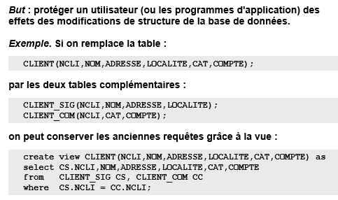

*Synthèse écrite par M. Petit sur base du cours donné par S. Faulkner s'appuyant sur un support de cours réalisé par J-L Hainaut.
Des phrases sont reprises en partie ou tels quelles de ce document.*

## BDD

### DML avancé

#### Sommaire
* Les contôles d'accès
  * les rôles
* Les Vues
  * matérialisée
  * non-matérialisée
  * Utilité
  * modification
* Extensions de la structure SelectFromWhere (SQL3)
  * SELECT
  * FROM
  * Jointures 3.0
* Les Requêtes récursives (pas vu)
* Les Extensions Objets (SQL3)
* Type de données complexes
* Les Prédicats
* Les Procédures

#### Le contrôle d'accès

* Contrôle d'accès **discrétionnaire**, le propriétaire (créateur de l'objet) peut tout faire et peut transmettre ses droits en partie ou totalement a un autre utilisateur et notamment l'autoriser a transmettre lui-même les droits auxquels il a accès. Le propriétaire peut retirer des privilèges accordés. 

```
grant update(QSTOCK,PRIX) - le droit attribué
  on    PRODUIT ----------- l'objet concerné
  to    P_MERCIER; -------- utilisateur bénéficiaire
  with grant option; ------ accorde le droit de transmettre ses privilèges
```
* Attention, quand on retire les pribilèges a un utilisateur, on ne retire pas forcément les privilèges qu'il aurait pu lui-même transmettre !

```
revoke update(PRIX)
     on     PRODUIT
     from   P_MERCIER;
...
revoke grant option for update (COMPTE)
     on     CLIENT
     from   P_MERCIER;
```

 ##### Les rôles
 Créer un rôle permet de défninir une suite de privilège qu'il sera possible d'attribuer aux utilisateurs ayant les mêmes besoins (qui ont le même role ...).
 
 ```
 create role CONSULTANT; ------------------------------------ on crée le rôle
 grant select on CLIENT to CONSULTANT; ---------------------- on accorde des privilèges à ce rôle
 grant update (ADRESSE, LOCALITE) on CLIENT to CONSULTANT;
 grant CONSULTANT to P_MERCIER; ----------------------------- on attribue un rôle à un utilisateur
 ```
 

#### Les Vues

* Table virtuelle (créée comme une vraie table) sans données stockées, qui présente différement une partie de la base de donnée (par exemple sur base d'une requête souvent demandée).

```
create view COM_COMPLETE(NCOM,NCLI,NOMCLI,LOC,DATECOM)
  as  select NCOM,COM.NCLI,NOM,LOCALITE,DATECOM
      from   CLIENT CLI,COMMANDE COM
      where  COM.NCLI = CLI.NCLI;

... 
/* se consulte comme une table normale */
select NOMCLI,NCOM,DATECOM
     from   COM_COMPLETE
     where  LOC = 'Toulouse'; 
...
drop view COM_COMPLETE

```
* une vue n'occupe pas bcp de place, seule sa définition est est stockée. (peut-être pas la même chose pour les vues matérialisées... voir plus bas)

##### Les vues non-matérialisées 
Elle n'est pas pré-calculée, elle n'est calculée que lors de l'appel de la vue.

##### Les vues matérialisées

Par souci de performance (dans des BD bien "fatou"), elle est pré-calculée et stockée temporairement sur le disque. On met en place des moniteurs qui vont surveiller les changements qui sont faits sur la BD et la vue sera recalculée selon deux tactiques : soit à chaque changements, soit après un certain temps pour prendre en compte plus de changements (c'est un domaine de recherche entier qu'il avait dit !)

##### Utilité 
1) Interface toute prête pour des requêtes fréquemment effectuées.
2) Gestion d'accès : Restreindre l'accès à certaines vues en fonction du rôle de l'utilisateur.
```
grant  select on VIEW to MERCIER;
```
3) "Évolution friendly", Permet de réutiliser d'ancienne QUERY malgré le changement de certaines tables.

4) Formulation de requêtes complexe (par exemple on ne peut faire de fonction aggrégatives sur une fonction aggrégative)
```
create view VAL_STOCK(STOCK,VALEUR) as
  select P.NPRO, (QSTOCK - sum(D.QCOM))*PRIX
  from   DETAIL D, PRODUIT P 
  where  D.NPRO = P.NPRO
  group by P.NPRO, QSTOCK, PRIX; 

  select sum(VALEUR) from VAL_STOCK;
```
5) ...
##### Modification
* On peut modifier une vue ssi elle respecte certaine condition ! Dont vous pouvez avoir un apercu en slide 21 ou [ici](https://dev.mysql.com/doc/refman/8.0/en/view-updatability.html)
* Si on ajoute dans une vue une ligne qui ne respecte pas les conditions de base, la ligne ne sera pas rejetée mais elle n'apparaitre pas dans un `SELECT` de la vue, **comportement irrégulier** de la vue. `with check option` permet d'obliger la vue à rejeter les changements non-conformes au conditions de la vue. Plus d'info sur `with check option` et ses limites [ici](https://www.ibm.com/support/knowledgecenter/fr/SSGU8G_11.50.0/com.ibm.ddi.doc/ids_ddi_096.htm).


#### Extensions de la structure SFW
> Passage à SQL 3 permet de lever une certaine rigidité dans les structures de requètes, il apporte des extensions à ces requètes.

* La ou on peut mettre une valeur, on peut y mettre toute expression retournant une valeur (y compris une requete SFW).

* La ou on peut mettre une table, on peut y mettre toute expression retournant une table (y compris une requete SFW).

* Nouveaux opérateurs de jointures !!

#####Extension de SELECT

* On peut mettre un ``SELECT`` dans un ``SELECT``.
```
select NCOM, (select sum(QCOM*PRIX)
                   from   DETAIL D, PRODUIT P
                   where  D.NPRO = P.NPRO
                   and    D.NCOM = M.NCOM) as MONTANT
     from   COMMANDE M
     where  MONTANT > 1000;
/* Retourne le numéro des commandes dont le montant a dépassé 1000 */
```
##### Extension de FROM

* On peut mettre un ``SELECT`` dans un ``FROM``.
```
select avg(MONTANT) 
     from  (select NCOM, sum(QCOM*PRIX) as MONTANT
            from   DETAIL D, PRODUIT P
            where  D.NPRO = P.NPRO
            group by NCOM);
/* Retourne la moyenne des montants des commandes */
```

##### Jointures 3.0

* `from T1 natural join T2`, jointure sur les 2 colonnes ayant le même nom

* `from T1 join T2 using (NOM_COLONNE)`, on précise la colonne de jointure

* `from T1 natural join T2 on (T1.NOM_COL = T2.NOM_COL)`, on précise les deux noms des colonnes de jointure.

* `from T1 cross join T2`, à but analytique, chaque ligne de T1 est associé à chaque ligne de T2 (ex: si deux tables de 3 lignes , 3x3 = tables résultantes de 9 lignes).

* `inner join` ne renvoie que les lignes qui ont une correspondance dans les deux tables.

* `left outer join` renvoie toutes les lignes de T1 même si il n'y a pas de correspondance dans T2 (et donc il y aura un null dans T2, à droite).

* `right outer join` fait l'inverse, renvoie toutes les lignes de T2 même si il n'y a pas de correspondance dans T1. Des `null` du coté gauche, dans T1.

* `full outer join` permet d'afficher toutes les lignes de T1 et toutes les lignes de T2, même si certaines lignes de T1 ou T2 n'ont pas de correspondances dans l'autre table. Des  `null` apparaitront des deux côtés.

  * les trois `outer join` font en fait apparaitre les lignes célibataires dont nous parlions [ici](https://github.com/EPHEC-TI/2TI/blob/master/202-DevAvanc%C3%A9Web/3-BaseDeDonn%C3%A9es/synth%C3%A8se_DML_2.md#c%C3%A9libat).
  


#### Les requêtes récursives
//Il me semble que ça n'a pas été vu en classe. 

#### Extensions objet (SQL3)

#### Types de données complexes

* `row` une case composée de plusieurs valeurs de type différents.
```
create table CLIENT(
	   NCLI    char(10) not null primary key,
	   NOM     char(32) not null,
	   ADRESSE row(RUE char(30), LOCALITE char(60)),
	   CAT     char(2));
```

* `array` plusieurs possiblités pour une case, (deux villes pour une localité par exemple).

```
create table CLIENT2(
	   NCLI     char(10) not null primary key,
	   NOM      char(32) not null,
	   PRENOM   char(15) array(4), ------------------------------- on peut entre jusqu'à 4 PRENOM
	   ADRESSES row(RUE char(30), LOCALITE char(60)) array(2), --- on peut entrer 2 ADRESSES de type ROW.
	   CAT      char(2));

```

* création de ``type`` par l'utilisateur.
```
create type Chaine as varchar(60) default '?';
create type Contact as (RUE Chaine, LOCALITE Chaine);
...
create table CLIENT(
	   NCLI    char(10) not null primary key,
	   NOM     Chaine not null,
	   ADRESSE Contact,
	   CAT     char(2));

```
* `tables typées` ! 

```
create type TPERSONNE as (
	   NCLI     char(10),
	   NOM      Chaine,
	   ADRESSE  Contact,
	   LOCALITE char(2));
...
create table CLIENT of TPERSONNE;
```
Il est d'ailleurs possible de faire de l'héritage de type, l'enfant hérite de tous les champs de la mère et peut en définir d'autres 
```
create type TCLIENT under TPERSONNE as (
   CAT    char(2),
   COMPTE decimal (9,2));
```


#### Les Prédicats 

* `check` permet d'établir un prédicat, c'est à dire la vérification d'une condition qui doit être satisfaite à tout moment. Si après une modification le prédicat n'est plus vrai, la modification est annulée. Permet d'introduire des contraintes liées au domaine d'activités, des contraintes métiers ! Peut s'appliquer sur des tables, des colonnes ou même des `domain`.

```
create table CLIENT ( NCLI  ...,
                           ...,
                           CAT   char(2),
                  primary key (NCLI),
                  check (CAT is null or 
                         CAT in ('B1','B2','C1','C2'));
```


#### Les Procédures 

* Procédure stockée dans la base de donnée, qui peut être appelée par un programme extérieur, par une autre procédure SQL ou par un déclencheur (trigger).

```
create procedure NOM_PROCEDURE (param)
begin
    /*code*/
end;
...
call NOM_PROCEDURE(param);
```

#### Les déclencheurs

* un `trigger` sert à la gestion d'évènements, permet une gestion active de la BDD (ajoute un comportement actif autonome à la BDD).
Basé sur le modèle ECA (événement, condition, action).

- Un trigger peut appeler d'autres triggers.
- Plusieurs triggers peuvent être associés à une même table (on définit l'ordre d'exécution des triggers dans ce cas).
- Sous certaines conditions (violation de l'intégrité,...) le trigger et ses actions sont annulés.
- On peut intéragir avec l'extérieur de la BDD.
- Un trigger peut se redéclencher lui-même (récursivité - attention à ne pas créer de boucles infinies). 

```
create trigger NOM_TRIGGER
before/after E ---------------- Avant/après l'évènement E (insert, delete)
[for each row / for each statement]
when C ------------------------ pour autant que Condition soit satisfaite
begin
    A ------------------------- éxécuter l'action A
end;
```

- `old` est la valeur d'une colonne avant l'événement (ex: old.COMPTE)
- `new` est la valeur d'une colonne après l'événement (ex: new.COMPTE). Peut être modifié dans `A` (ex: if ... then new.COMPTE = 0).
- `for each row` spécifie pour chaque ligne de la requète.
- `for each statement`spécifie pour chaque requète.
