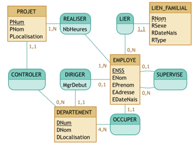

*Synthèse écrite par M. Petit sur base du cours donné par S. Faulkner.
Des phrases sont reprises en partie ou tels quelles de ce document.*

## BDD

### Le modèle Entité-association

Le but est de réaliser un schéma qui puisse être compréhensible apr un non-informaticien et ainsi mieux cerné avec l'utilisateur final les contraintes métiers, ... à implémenter.  
Par la suite, ce schéma sera "traduit" en un schéma relationnel, implémentable sur n'importe quel SGBD. 

* Une ``entité`` est un objet spécifique (une information principale) du domaine d’application qui est représenté dans la base de données.

* Un ``attribut``est une propriété qui caractérise l’information que l’on veut garder sur une entité.

* Une entité spécifique se voit associer une ``valeur`` (instance, occurrence) pour chacun de ces attributs.

* Chaque attribut possède un ``type de valeur`` associé: (integer, string, subrange, enumerated, …).
  * ``simple``
  * ``composite``, composé d'autres attributs.
  * ``Multi-valeurs``, peut posséder une ou plusieurs valeurs.
  * ``Optionnel``

* ``Identifiant`` (ou clé): attribut ou ensemble d’attributs d’une entité E permettant de déterminer de manière unique chaque instance de E

* ``Contrainte d’unicité``: contraint la valeur associée à un attribut d’une entité E à être unique pour l’ensemble des instances de E

* Une ``association`` relie sémantiquement des entités distinctes
  * `type` : unaire, binaire N-aire (nombres d'entités participantes).
  * Deux entités peuvent être reliées par plusieurs associations.
  * la `cardinalité` spécifie pour chaque entité le nombre minimal et maximal d'instances participantes dans l'association.
  * Une association peut posséder des `attributs`.
  * La participation peut être (assoiciation binaire) : obligatoire si le minimu de cardinalité est à 1, ou optionelle si le minimum de cardinalité est à 0.
  * Selon la cardinalité, une association peut être `Many-to-Many (_,N - _,N)` , `One-To-Many (_,1 - _,N)` ou `One-to-One (_,1 - _,1)`. Comme on peut le constater, on ne s'intéresse qu'à la cardinalité maximum. 

<u>*Many-to-Many*</u>

<u>*One-to-Many*</u>

<u>*One-to-One*</u>

<u>*Association N-aire*</u>   

  
*On estime qu'il ya relation N-aire QUE si sur chaque branche on a exactement la même cardinalité (= 95% des cas).* 

  
<u>*Rôle d'une association (obligatoire pour les unaires)*</u>

<u>*Association Unaire*</u>  

* Une entité faible ne possède pas d'indentifiant au sein de ses attributs, elle a donc besoin de l'identifiant de l'entité à laquelle elle est associée. La cardinalité du coté de l'entité faible sera TOUJOURS de 1,1.

* la `Généralisation` est un type d'association qui correspnd à l'héritage (relation généralité -> spécificité).  

  * `propriétés d'une généralisation`
    * `total`, une personne ne peut être encodée sans être aussi encodé dans un des enfants (ici, HOMME OU FEMME).
    * `partiel` une personne peut être encodée sans être un des enfants (MANAGER, SECRETAIRE, EMPLOYE).
    * `exclusif`, une personne peut-être un des deux enfants mais pas les deux (on peut pas être HOMME et FEMME).
    * `chevauchement`, on peut être les deux enfants (une MANAGER peut être TECH_MGR et ADMIN_MGR).  
    

  * Toutes les associations de la super-entité sont également héritées par les sous-entités. 

