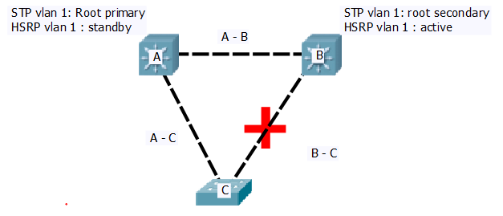

*Réalisé par M. Petit - N'hésitez pas à comparer cela avec d'autres doc histoire d'être sure que ce soit pas du bullshit, il est possible qu'il y ai des erreurs, si vous en voyez une hésitez pas à me prévenir <3*


### INFRASTRUCTURE RESEAU - NETWORK INFRASTRUCTURE
#### Sommaire
* [Mode de configuration](#confMode)
  * [user](#userMode)
  * [privileged](#privilegedMode)
  * [config global](#globalMode)
  * [config line](#lineMode)
  * [config interface](#interfaceMode)
  * [config vlan](#confvlan)
  * [config routage](#routingMode)
* [Identity](#identity)
* [Security](#security)
* [SSH](#ssh)
* [VLAN](#vlan)
  * [Création](#creation)
  * [Configuration interfaces](#interfacevlan)
  * [Routage inter-Vlan](#intervlan)
    * [Router](#subif)
      * [IP vlan](#ipvlan_1)
      * [Access](#access_1)
      * [Trunk](#trunk_1)
    * [Switch Layer 3](#vlanL3)
      * [IP vlan](#ipvlan_2)
      * [Access](#access_2)
      * [Trunk](#trunk_2)
* [Routing](#routing)
  * [RIP](#RIP)
  * [OSPF](#OSPF)
  * [EIGRP](#EIGRP)
  * [Vieux matos](#old)
* [DHCP](#dhcp)
* [NAT](#nat)
  * [statique](#natSt)
  * [dynamique](#natDyn)
* [STP](#stp)
* [VTP](#vtp)
* [Etherchannel](#ether)
  * [LACP](#lacp)
  * [Pagp](#pagp)
* [HSRP](#hsrp)

<a id="confMode"></a>
#### MODE 
<a id="userMode"></a>
* `Router>` user EXEC mode  
  * `enable` passer au mode de conf supérieur

<a id="privilegedMode"></a>
* `Router#` privileged EXEC mode    
  * `configure terminal` passer au mode de conf supérieur
  * `no ip domain-lookup` désactive la résolution de nom, donc quand il ne connait pas une commande, il ne va pas tenter de résoudre cette commande comme si c'était une machine du réseau et tenter de la joindre.
  * `show protocols` information de couche 2 et 3 comme `show ip interface brief` mais avec la présence du subnet mask en plus.
  * `show ip protocols` montre des informations sur les différents protocoles de routage configurés
<a id="globalMode"></a>
* `Router(config)#` global configuration mode    
  * `interface ...` enter (sub-)interface configuration mode  
  * `router ...` enter routing configuration mode  
  * `line ...` enter line mode configuration (console or vty)

<a id="lineMode"></a>
* `Router(config-line)#` line configuration mode
  * `login local` demande l'authentification par password lors d'une connection en local (directement sur la machine via un cable console).
  * `logging synchronous` synchronise les logs de cette ligne (vty ou console) avec le terminal de la machine. Il est possible de régler le niveau de level des logs que l'on veut afficher
  * `transport input ssh` voir [SSH](#ssh).

<a id="interfaceMode"></a>
* `Router(config-interface)#` interface configuration mode
  * `description +msg` Pas de règles quant à la forme du msg, pas besoin de délimiteur.
  * `ip address +ip +mask` adresse de l'interface
  * `clock rate` définit le clock rate **seulement nécessaire sur une liaison série !**
  * `shutdown` désactive une interface, souvent utilisée dans sa version négative `no shutdown` pour activer l'interface.
  * `ip helper-address` spécifie une destination à laquelle transmettre les broadcasts. Mécanisme par exemple utile lorsqu'on veut utiliser un serveur DHCP qui se trouve dans un autre réseau (et donc derrière un routeur).

<a id=confvlan></a>
* `Switch(config-vlan)#` vlan configuration mode
  * `name +nom` donne un nom au vlan

<a id="routingMode"></a>
* `Router(config-router)#` routing configuration mode.
  * `network +ip +wildcardMask` annonce un réseau connu en tant qu'information de routage.
  * `passive-interface +interface` permet d'empêcher l'envoi d'information de routage sur l'interface précisée. Ce sont énormément d'informations sur le réseaux qui sont transmises donc il est donc bon de réduire au maximum la portée de ces transmissions là où ce n'est pas nécessaire.
  * `redistribute` permet de transmettre les infos concernant un protocole différents ou des routes statiques. Plus de précision dans [routing](#routing).

#### NETTOYAGE
* `erase start-up config`
* `delete vlan.dat` 

<a id="identity"></a>
#### IDENTITY 
* `hostname` nom de la machine dans le domaine
* `ip domain-name +nom-du-domaine` configure le nom du serveur dns, utiliser avec
`ip name-server +ip` configure l'ip du serveur DNS.
* `banner login #message#` Message qui apparaitra a la console si quelqu'un tente de se logger sur la machine, avant toute démarche de log. Il est possible d'utiliser n'importe quel caractère d'ouverture et de fermeture du message, ici '#'.
* `username admin privilege 15 secret cisco` enregistre un utilisateur *admin* de privilege *15* ( le plus haut ) dont le mot de passe est *secret*.

<a id="security"></a>
#### SECURITY  
> certaines commandes de sécurité (notamment pour ssh) ne sont accessibles qu'en activant une license (achetée à cisco bien sure), activable avec la commande 
`license boot module +numModele technology-package securityk9`, après il faut `copy run start` et puis restart la machine.

* `enable password +pswd` oblige le controle d'un mot de passe pour entrer en mode de configuration privilégié. [Possible de passer en option un mot de passe encrypté mais seulement de type 5 ou déja encrypté par du matos cisco.](http://www.cisco.com/c/en/us/td/docs/ios/12_2/security/command/reference/fsecur_r/srfpass.html)
* `enable secret +pswd` ajoute une couche de sécurité en plus de `enable password` et annule la possibilité d'utiliser le paswd configuré avec `enable password` !
* `service password-encryption` encrypte les password, ils ne seront plus visibles en clair dans des `sh run` par exemple.

###### [interfaces](http://www.cisco.com/c/en/us/td/docs/switches/lan/catalyst6500/ios/12-2SX/configuration/guide/book/port_sec.pdf)

* `switchport port-security` active les modifications de sécurité ! Si pas tapée, rien n'agit !
* `switchport port-security mac-adress +mac-adress` autorise la mac-adress spécifiée à accéder à cette interface
* `switchport port-security mac-adress sticky` autorise dynamiquement la mac-adress captée sur cette interface
* `switchport port-security max +num` définit le nombre max de mac-adress gardé en mémoire, si le nombre est atteint, plus aucune adresse ne peut être autorisé de quelque manière que ce soit
* `switchport port-security violation` définit le type de comportement en cas de violation

<a id="ssh"></a>
#### SSH    
###### configuration globale
`ip ssh version 2` Pretty clear ...

`#crypto key generate rsa 2048 `
Génère une clé rsa de 2048 bit, le 2048 est a placé après !

###### configuration ligne vty
`transport input ssh` n'autorise la connexion à cette ligne que via ssh.

<a id=vlan></a>
#### VLAN 
<a id=creation></a>
#### Création 
* sur un switch (L2 ou L3), `vlan +num` entrer en mode de configuration de ce vlan ([voir configuration mode vlan](#confvlan)).  
* il peut être intéressant de créer un vlan "poubelle", dans lequel on mettra toutes les interfaces n'appartenant à aucun vlan.
* il est bon de changer le vlan natif (par défaut c'est le 1), mais ne pas désactiver le 1 car c'est par la que les premières attaques viendront. Et surtout c'est par le vlan 1 que les paquets STP passent !!!
* si l'interface de vlan est up-down, c'est qu'aucune interface réelle n'est incluse à ce vlan.
* Chez cisco, tous les vlans sont par défaut autorisés sur les trunks. Seulement chez Cisco !!

<a id=intervlan></a>
#### Routage inter-vlan 
<a id="subif"></a>
##### Sur un router 
<a id="ipvlan_1"></a>
###### Ip vlan 
* Une sous interface par vlan, attention, l'encapsulation dot1q doit être faite avant pour qu'on puisse donner une ip a nos sous-interfaces. `encapsulation dot1q +numVlan +[native]`. 
```
interface f0/0.20
    encapsulation dot1q 20 
    ip address 192.168.20.1 255.255.255.0
  ...
interface f0/0.30
    encapsulation dot1q 30
    ip address 192.168.30.1 255.255.255.0
  ...
```
<a id="access_1"></a>
###### mode access 
* sur un switch L2 ou L3.

```
Switch(config)#interface F0/1/1
Switch(config-interface)#switchport mode access
Switch(config-interface)#switchport access vlan 20

```
<a id="trunk_1"></a>
###### mode Trunk 

```
Switch(config)#interface G0/2
Switch(config-interface)#switchport mode trunk
Switch(config-interface)#switchport trunk native vlan 50
```
<a id="vlanL3"></a>
##### Sur un layer 3 
* il est obligatoire de désactiver la fonction de switching sur l'interface d'un L3 connecté à un autre routeur `(config-interface)#no switchport`.
<a id="ipvlan_2"></a>
###### Ip vlan 
* Comme un layer 3 possède plusieurs SVI (Switch Virtual Interface), on peut attribuer une ip par interface de VLAN.
```
interface vlan 20
  ...
  ip address 192.168.20.254 255.255.255.0
  ...
interface vlan 30
  ...
  ip address 192.168.30.254 255.255.255.0
  ...
```
<a id="access_2"></a>
###### Access 
* [Voir L2](#access_1)
<a id="trunk_2"></a>
###### Trunk 
* **Sur un L3**, il faut utiliser une ancienne commande pour configurer le trunk `switchport trunk encapsulation dot1q`, le reste est [pareil qu'avec un L2](#trunk_1).


<a id="routing"></a>
#### ROUTING
<a id="RIP"></a>
###### RIP
<a id="OSPF"></a>
###### OSPF 
* `router ospf 1` ici le numéro de process n'a pas d'importance, il n'a qu'une portée locale (contrairement à EIGRP ou il désignera le numéro d'AS, Système Autonome).
* Quand on déclare un réseau avec la commande ``network``, il est important de préciser l'area dans laquelle il se trouve. Ainsi pour des routeurs "interne" à une zone, on ne déclarera que des réseaux d'une même zone.
Par contre un **ABR** (Area Border Router), déclarera des réseaux de plusieurs zone.
ex :

```
R4(config-if)# router ospf 2
R4(config-router)# network 192.168.99.0 0.0.0.255 area 0
R4(config-router)# network 192.168.254.251 0.0.0.0 area 0
R4(config-router)# network 172.16.99.0 0.0.0.255 area 2
```


* `area +n°` paramètre de la zone 'n°'
  * `stub` en faire une zone 'stubby'
  * `nssa` en faire une zone 'not so stubby'
  * `range` résumé de route (ABR seulement)
* `default-information originate` redistribue les informations concernant la route par défaut seulement (seulement si il s'en trouve une dans la table de routage).
* `redistribute static subnets` permet de redistribuer de routes vers un un réseau (un ancien réseau par exemple, qui n'utiliserait pas OSPF mais relié à une zone OSPF) qu'elles soit classfull ou non.
* `redistribue connected subnets` ??? comprends pas la différence avec la précédente ...

* en OSPF il peut-être interessant de définir un ID (pour l'élection DR-BDR) au moyen d'une interface de loopback, `interface l0`.
* en mode privilégié, quelque commandes intéressantes :
  * `show ip route` table de routage
  * `show ip ospf neighbor` table de voisinage

<a id="EIGRP"></a>
###### EIGRP 
<a id="old"></a>
###### Vieux matos 
<a id="dhcp"></a>
#### DHCP 
* `ip dhcp pool <nom>`
  * `dns-server <ip>`
  * `default-gateway <ip>`
  * `network 192.168.0.0 255.255.255.0`

Exclure un pool d'adresse du DHCP : 
`ip dhcp excluded-address <ip-start> <ip-end>`

<a id="nat"></a>
#### NAT  

[NAT simplifiée](https://campus-virtuel.ephec.be/sites/2016_HE_T2032_9366_L2/_layouts/15/WopiFrame.aspx?sourcedoc=/sites/2016_HE_T2032_9366_L2/Documents/IRBP%20Semaine%2011/NAT%20version%20simplifi%C3%A9e/NAT_version%20du%207-12-2016.pdf&action=default)

<a id="natSt"></a>
###### statique 

* en statique on associe une adresse ip interne privée à une adresse publique, utile par exemple quand on a besoin d'atteindre un serveur toujours à la même adresse. 
Il faut préciser sur le routeur NAT quel interface est en inside et quelle interface est en outside et puis déclarer la NAT proprement dite

```
interface GigabitEthernet0/0
...
ip nat inside 

interface GigabitEthernet0/1
...
ip nat outside 
...
ip nat inside source static 10.0.0.2 202.0.5.1
```
<a id="natDyn"></a>
###### dynamique 

* PAT (surcharge de port, une seule ip publique)

```
interface GigabitEthernet0/0
...
ip nat inside
!
interface GigabitEthernet0/1
...
ip nat outside
!
ip nat inside source list 1 interface GigabitEthernet0/1 overload
!
access-list 1 permit 10.0.0.0 0.0.0.255
```

* POOL d'adresses publiques

```
! attention a bien toujours configurer vos interfaces in et out 
ip nat pool TOTO 201.10.10.1 201.10.10.2 netmask 255.255.255.0
ip nat inside source list 1 pool TOTO overload
access-list 1 permit 10.0.0.0 0.0.0.255
```
<a id="stp"></a>
#### Spanning Tree Protocol  

> [Spanning Tree Protocol (STP)] is a Layer 2 protocol that runs on bridges and switches.The main purpose of STP is to ensure that you do not create loops when you have redundant paths in your network. Loops are deadly to a network.

**Par défaut, spanning tree tourne sur toutes les interfaces ! Et transmet ses informations via le VLAN 1, qu'il ne faut donc absolument pas fermer !**

* besoin d'un switch référent, un switch "root" qui va être élu par les autres, point central du réseau (un ID plus petit est meilleur !). Toutes les décisions (port bloquant ou forwardant) sont prises en fonction de ce switch. **Chaque vlan doit avoir un root switch qu'il soit logique ou physique**
Les critères à prendre en compte pour déterminer ce switch : 
  * centralisé
  * fiable (pas une partie du réseau souvent perturbée)
  * le moins influencé par des changements de topologie 
  * en fonction des réglages [HSRP](#hsrp)
  
* `monSwitch(config)#spanning-tree vlan 1 root primary` définit monSwitch comme switch root pour le vlan 1 (priorité de 8192).

* `monSwitch(config)#spanning-tree vlan 1 priority 4096` définit la priorité du switch à 4096 (par défaut à 32768 et par pas de 4096).

* `monSwitch(config)#spannig-tree portfast default` définit portfast sur tous les ports en mode access. ATTENTION : portfast met l'interface en mode forward sans attendre la convergence STP (utile par exemple en cas de DHCP ou le pc peut obtenir une ip avant la fin de la convergence STP) donc en cas de mauvais configuration des interfaces, des boucles de broadcast peuvent apparaitre.

* `show spanning-tree` 
<a id="vtp"></a>
#### Vlan Trunking Protocol  

> VLAN Trunk Protocol (VTP) reduces administration in a switched network. When you configure a new VLAN on one VTP server, the VLAN is distributed through all switches in the domain. This reduces the need to configure the same VLAN everywhere. VTP is a Cisco-proprietary protocol that is available on most of the Cisco Catalyst series products.

**Par défaut, tous les switchs sont configuré comme VTP serveurs.**

* tous les switchs doivent avoir le même domaine vtp, faire tourner la même version de VTP et avoir le même mot de passe (si il y en a un).

* on peut configurer le vtp en mode de configuration de vlan ou en mode de configuration globale (ici en global).

* `vtp domain +domain-name`
* `vtp mode +{server | transparent | client }` le serve envoie, le client recoit se synchronise et transmet et le transparent ne fait rien. (transparent permet de faire des modifs vlan en local sans affecter les autres et remet le compteur de changement à zéro).
<a id="ether"></a>
#### EtherChannel   
* EtherChannel permet de faire de l'aggrégation de ports, càd considérer jusqu'à 8 liaison comme une seule (load-balancing, vitesse ++, ...).
* Même si on pourrait croire que des ports agrégés n'ont pas besoin de configurations individuelles, c'est mieux de le faire en cas de comportements capricieux d'un appareil.
* Plus souvent vu sur des switchs, il est possible de le faire entre un [routeur et un switch](http://www.cisco.com/c/en/us/support/docs/switches/catalyst-2950-series-switches/24042-158.html) ou [entre deux routeurs](https://learningnetwork.cisco.com/thread/33881)  
<a id="lacp"></a>
##### LACP 
* LACP est le standard en matière d'etherchannel >< Pagp qui est propriétaire cisco
```
interface port-channel 1
	switchport trunk encapsulation dot1q
	switchport mode trunk
	switchport trunk native vlan 2
interface range f0/10-11
	channel-protocol lacp
	channel-group 1 mode active
	exit
```
* `mode active` est la solution safe pour être sure de l'état du port.
<a id="pagp"></a>
##### PAGP 

* propriétaire cisco, la configuration est sensiblement la même ... 
<a id="hsrp"></a>
#### HSRP 

* Permet le regroupement de deux Switch physique en un switch logique (redondance, remplacement en cas de panne sans changer d'ip, ...).
* Tout comme vtp,stp et consor, il y aura un switch "root" qui sera dit ACTIF, et l'autre sera en STANDBY. Et cela pour chaque vlan indépendamment (donc c'est pas d'office le même actif et le même passif en fonction du vlan #optimisation).
* Cisco considère qu'il est mieux de tout faire passer par un seul switch et de laisser l'autre en standby total. Schalkwijk estime qu'il y a plein de raison de ne pas faire comme ça (rien que le fait qu'on laisse un Layer 3 rien foutre alors que c'est du matos dingue en est une bonne).

```
...
interface vlan 90
	ip address 10.1.90.252 255.255.255.0
	standby 90 ip 10.1.90.254
	standby 90 priority 100
	standby 90 preempt
	no shut 
	exit
...
```
* `standby 90` définit le groupe hsrp concerné
* `ip x.x.x.x` correspond à l'adresse ip virtuelle du switch logique créé
* `priority <0-255>`définit le poids à devenir actif (plus grand = meilleur)
* `preempt` permet de recalculer l'actif et le standby si une priorité supérieure apparait (en cas de retour du switch principal qui aurait crashé par exemple)

* Il faut faire attention si on joue avec des switch actif et standby différents par vlan de garder une cohérence par rapport à STP. Exemple (voir schéma-ci dessous), ici comme A est root primary, la laison B - C est bloquante (symbolisé par une magnifique croix rouge, merci outil de dessin de Packer tracer <3). Or on voit que B configuré de tel sorte qu'il est actif au niveau HSRP pour le vlan 1. Donc le traffic du vlan 1 va être obligé de passer par B, mais comme la liaison B-C est bloquante, le traffic qui vient de C passera par A avant d'aller à B = détour. Ici A devrait etre actif pour le vlan 1 ou être le root secondary pour STP.


