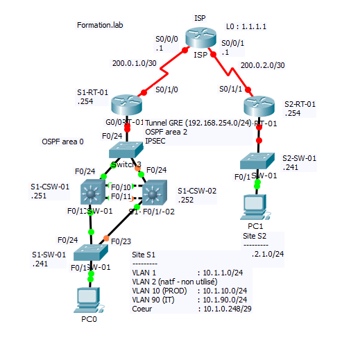

* Configuration du labo récapitulatif - mai 2017 - Martin Petit
Comme d'hab hésitez pas si vous voyez des erreurs ou des choses à améliorer, 
pour les questions aussi hésitez pas !*

**schéma reseau**


##### Remarque/Rappel
* `ip routing` sur un Layer 3 permet d'activer les fonctions du routage (intervlan ou autre).
* pour VTP, ne pas oublier qu'il faut configurer les interfaces trunk et donc le vlan natif ches tous les autres switch
* ATTENTION, en fait dans cet exercice, les vlans ne remonteront pas plus haut que les layers 3, c'est eux
qui vont s'occuper du routage inter-vlan et donc ce qui est appelé "coeur" c'est la partie coincée entre les devices 
de couche 3, le routeur d'un coté et les SWL3 de l'autre. Ainis toutes ces liaisons ne seront pas des trunks ! 
* `sh interfaces switchport` permet de vérifier l'état (trunk/access) d'une interface
*  `etherchannel` et HSRP sont des choses différentes ! Le premier permet l'aggrégation de ports,
le deuxième l'aggrégation de switch.

**area 1**
```
!----------------------------------------------------------------------
! S1-RT-01
!----------------------------------------------------------------------
!
hostname S1-RT-01 
!
interface G0/0
	ip address 10.1.0.254 255.255.255.0
	no shut 
	exit
!
interface S0/1/0
	ip address 200.0.1.2 255.255.255.252
	no shut
	exit
!
! default-gateway
ip route 0.0.0.0 0.0.0.0 S0/1/0
! GRE tunnel (needed to avoid flip-flop og the interface, voir plus bas dans problèmes rencontrés)
ip route 200.0.2.2 255.255.255.255 S0/1/0
!
! GRE
!
interface Tunnel0
 ip address 192.168.254.1 255.255.255.0
 tunnel source Serial0/1/0
 tunnel destination 200.0.2.2
 no shut
 exit
!
router ospf 1
	network 10.1.0.248 255.255.255.248 area 0
    	network 192.168.254.0 255.255.255.0 area 2
	default-information originate
	exit
!----------------------------------------------------------------------
! Switch3
!----------------------------------------------------------------------
hostname Switch3
!
ip default-gateway 10.1.0.254
!----------------------------------------------------------------------
! S1-CSW-01
!----------------------------------------------------------------------
hostname S1-CSW-01
!
! STP
spanning-tree vlan 90 root primary
spanning-tree vlan 10 root secondary
! VTP
!
vtp domain formation.lab
vtp mode server
vtp version 2
! vtp pruning ne marche pas sur packet tracer mais permet d'économiser la BP ! dans certains cas
!
! VLAN
!
vlan 2
    name Natif-NU

vlan 10
    name PROD
    
vlan 90
    name IT
    exit
!
interface f0/1
	switchport mode trunk 
	switchport trunk encapsulation dot1q 
	switchport trunk native vlan 2
	exit
!
interface range f0/2-9
	switchport mode access
	switchport access vlan 2
	shut
	exit
!
interface range f0/10-11
	switchport mode trunk 
	switchport trunk encapsulation dot1q 
	switchport trunk native vlan 2
	exit
!
interface range f0/12-23
	switchport mode access
	switchport access vlan 2
	shut
	exit
!
interface f0/24
	no switchport
	ip address 10.1.0.251 255.255.255.0
	no shut
	exit
!
interface range G0/1-2
	switchport mode access
	switchport access vlan 2
	shutdown
	exit
!
interface vlan 1
	ip address 10.1.1.251 255.255.255.0 
	no shut 
	exit
interface vlan 10
	ip address 10.1.10.251 255.255.255.0
    standby 10 ip 10.1.10.254 
    standby 10 priority 100
    standby 10 preempt
	no shut
	exit
interface vlan 90
	ip address 10.1.90.251 255.255.255.0
	standby 90 ip 10.1.90.254
	standby 90 priority 150
	standby 90 preempt
	no shut 
	exit
!
! etherchannel
!
interface port-channel 1
	switchport trunk encapsulation dot1q
	switchport mode trunk
	switchport trunk native vlan 2
	interface range f0/10-11
	channel-protocol lacp
	channel-group 1 mode active
	exit
!
! OSPF
! 
no router ospf 1
router ospf 1
	network 10.1.1.0 255.255.255.0 area 0
	network 10.1.10.0 255.255.255.0 area 0
	network 10.1.90.0 255.255.255.0 area 0
	network 10.1.0.248 255.255.255.248 area 0
	passive-interface F0/1
	exit
!----------------------------------------------------------------------
! S1-CSW-02
!----------------------------------------------------------------------
hostname S1-CSW-01
! STP
spanning-tree vlan 10 root primary
spanning-tree vlan 90 root secondary
!
! VTP
!
vtp domain formation.lab
vtp version 2
vtp mode client
!
interface f0/1
	switchport mode trunk 
	switchport trunk encapsulation dot1q 
	switchport trunk native vlan 2
	exit
!
interface range f0/2-9
	switchport mode access
	switchport access vlan 2
	shut
	exit
!
interface range f0/10-11
	switchport mode trunk
	switchport trunk encapsulation dot1q 
	switchport trunk native vlan 2
	exit
!
interface range f0/12-23
	switchport mode access
	switchport access vlan 2
	shut
	exit
!
interface f0/24
	no switchport
	ip address 10.1.0.252 255.255.255.0
	no shut
	exit
!
interface range G0/1-2
	switchport mode access
	switchport access vlan 2
	shutdown
	exit
!
interface vlan 1
	ip address 10.1.1.252 255.255.255.0 
	no shut 
	exit
interface vlan 10
	ip address 10.1.10.252 255.255.255.0
    standby 10 ip 10.1.10.254
    standby 10 priority 150
    standby 10 preempt
	no shut
	exit
!
interface vlan 90
	ip address 10.1.90.252 255.255.255.0
	standby 90 ip 10.1.90.254
	standby 90 priority 100
	standby 90 preempt
	no shut 
	exit
!
! etherchannel
!
interface port-channel 1
	switchport trunk encapsulation dot1q
	switchport mode trunk
	switchport trunk native vlan 2
	interface range f0/10-11
	channel-protocol lacp
	channel-group 1 mode active
	exit
!
no router ospf 1
router ospf 1
	network 10.1.1.0 255.255.255.0 area 0
	network 10.1.10.0 255.255.255.0 area 0
	network 10.1.90.0 255.255.255.0 area 0
	network 10.1.0.248 255.255.255.248 area 0
	passive-interface F0/1
	exit
!----------------------------------------------------------------------
! S1-SW-01
!----------------------------------------------------------------------
hostname S1-SW-01
! ip domain-name formation.lab
vtp domain formation.lab
vtp version 2
vtp mode client
!
ip default-gateway 10.1.90.254 
!
interface F0/1
	switchport mode access
	switchport access vlan 90
	exit
interface range F0/2-22
	switchport mode access
	switchport access vlan 2
	shutdown
	exit
interface range f0/23-24
	switchport mode trunk
	switchport trunk native vlan 2
	exit
interface range G0/1-2
	switchport mode access
	switchport access vlan 2
	shutdown
	exit
interface vlan 90
	ip address 10.1.90.241 255.255.255.0
	no shut
	exit

```

**area 2**
```
!----------------------------------------------------------------------
! S2-RT-01
!----------------------------------------------------------------------
!
interface Tunnel0
    ip address 192.168.254.2 255.255.255.0
    tunnel source Serial0/1/1
    tunnel destination 200.0.1.2
!
!
interface GigabitEthernet0/0
    ip address 10.2.1.254 255.255.255.0
!
interface Serial0/1/1
    ip address 200.0.2.2 255.255.255.252
!
no router ospf 1
router ospf 1
 log-adjacency-changes
 passive-interface GigabitEthernet0/0
 network 10.2.1.0 0.0.0.255 area 2
 network 192.168.254.0 0.0.0.255 area 2
!
! default-gateway 
ip route 0.0.0.0 0.0.0.0 Serial0/1/1 
! GRE needed avoid flip-flop ??
ip route 200.0.1.2 255.255.255.255 S0/1/1
!
!----------------------------------------------------------------------
! S2-SW-01
!----------------------------------------------------------------------

```
##### Problémes rencontrés

Au moment ou le tunnel GRE a été établi et semblait fonctionner, les interfaces tunnel 0 sur les deux routeurs n'arrétaient pas de virer up et down alternativement et foutait tout en l'air... message d'erreur de type:

**S2-RT-01**
```
01:31:11: %OSPF-5-ADJCHG: Process 1, Nbr 200.0.1.2 on Tunnel0 from FULL to DOWN, Neighbor Down: Interface down or detached

%LINEPROTO-5-UPDOWN: Line protocol on Interface Tunnel0, changed state to up

01:32:11: %OSPF-5-ADJCHG: Process 1, Nbr 200.0.1.2 on Tunnel0 from LOADING to FULL, Loading Done
 %ADJ-5-PARENT: Midchain parent maintenance for IP midchain out of 0 65E900C0 - looped chain attempting to stack
 %TUN-5-RECURDOWN: 0 temporarily disabled due to recursive routing

%LINEPROTO-5-UPDOWN: Line protocol on Interface Tunnel0, changed state to down

01:32:16: %OSPF-5-ADJCHG: Process 1, Nbr 200.0.1.2 on Tunnel0 from FULL to DOWN, Neighbor Down: Interface down or detached

%LINEPROTO-5-UPDOWN: Line protocol on Interface Tunnel0, changed state to up

01:33:21: %OSPF-5-ADJCHG: Process 1, Nbr 200.0.1.2 on Tunnel0 from LOADING to FULL, Loading Done
 %ADJ-5-PARENT: Midchain parent maintenance for IP midchain out of 0 65E900C0 - looped chain attempting to stack
 %TUN-5-RECURDOWN: 0 temporarily disabled due to recursive routing

%LINEPROTO-5-UPDOWN: Line protocol on Interface Tunnel0, changed state to down

01:33:31: %OSPF-5-ADJCHG: Process 1, Nbr 200.0.1.2 on Tunnel0 from FULL to DOWN, Neighbor Down: Interface down or detached
```
Et pareil sur l'autre routeur.
J'ai essayé d'ajouter deux routes staiques comme indiqué [ici](http://www.cisco.com/c/en/us/support/docs/ip/enhanced-interior-gateway-routing-protocol-eigrp/22327-gre-flap.html) (et ouais mec la doc cisco carrément). Mais ça ne marchait point ...  
