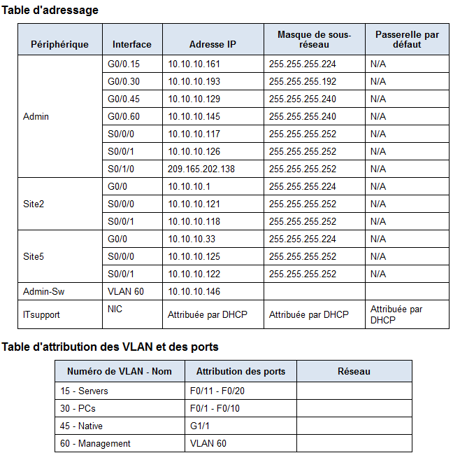
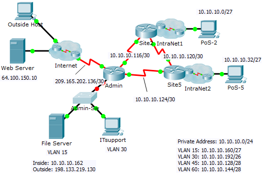

## Skills integration Challenge 

  



```
!------------------------------------------------------------------------
Admin-Sw
!------------------------------------------------------------------------
!
ip domain-name cisco.com
!
username Admin password letmein
service password-encryption
!
crypto key generate rsa
1024
!
ip ssh version 2
! les 2 commandes suivante n'est disponible dans packet tracer que après activation de ! ! ! licence et permettent respectivement de limiter a 2 tentatives d'authentification ssh
! et de terminer la possibillité d'authentification après 60 secondes
! ssh login-attempts 2
! ssh login-gracetime 60
!
ip default-gateway 10.10.10.145
!
line vty 0 15
    login 
    transport input ssh
    exit
! VLAN
! 
vlan 15
    name Servers
vlan 30
    name PCs
vlan 45
    name Native
vlan 60
    name Management
    exit
!
interface range f0/11-20
    switchport mode access
    switchport access vlan 15
    no shut
    exit
!
interface range f0/1-10
    switchport mode access
    switchport access vlan 30
    no shut
    exit
!   
interface G0/1
    switchport mode trunk
    switchport trunk native vlan 45
    no shut
    exit
!
interface vlan 60
    ip address 10.10.10.146 255.255.255.240
    no shut
    exit
!
interface F0/1
    switchport port-security
    switchport port-security maximum 2
    switchport port-security mac-address sticky
    switchport port-security violation restrict
    exit
    
!------------------------------------------------------------------------
Admin
!------------------------------------------------------------------------
! routage inter-vlan
!
interface G0/0
    no ip address
    no shut
interface G0/0.15
    description "Vlan serveurs"
    encapsulation dot1q 15
    ip address 10.10.10.161 255.255.255.224
    no shut
!
interface G0/0.30
    description "vlan PC"
    encapsulation dot1q 30
    ip address 10.10.10.193 255.255.255.192
    no shut
!
interface G0/0.45
    description "vlan natif"
    encapsulation dot1q 45 native
    ip address 10.10.10.129 255.255.255.240
    no shut
!
interface G0/0.60
    description "vlan de gestion"
    encapsulation dot1q 60 native
    ip address 10.10.10.145 255.255.255.240
    no shut
    exit
!
! DHCP 
! 
ip dhcp pool LAN
    network 10.10.10.192 255.255.255.192
    default-router 10.10.10.193
    exit
!
ip dhcp excluded-address 10.10.10.193
!
! ROUTAGE 
!
router ospf 1


```